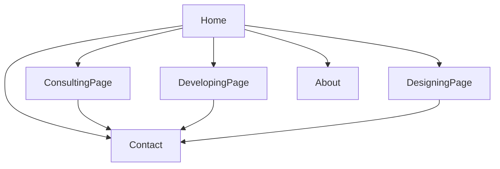

# Avoda Website Redesign Plan

## Goals

- Move from dark-heavy styling to a cohesive light-theme system.
- Make the homepage a scroll-first narrative that builds trust and summarizes the business.
- Replace broad service messaging with 3 focused service lines: Consulting, Developing, Designing.
- Create one page per service with structured content + a "Starting at" pricing block.

## Current Baseline (from code)

- Routing currently only includes home/about/contact in `[C:/Users/joshu/Desktop/Code/Avoda-website/src/App.jsx](C:/Users/joshu/Desktop/Code/Avoda-website/src/App.jsx)`.
- Home is assembled from hero + preview carousel + why us + process in `[C:/Users/joshu/Desktop/Code/Avoda-website/src/App.jsx](C:/Users/joshu/Desktop/Code/Avoda-website/src/App.jsx)`.
- Service messaging is mixed and click-driven in `[C:/Users/joshu/Desktop/Code/Avoda-website/src/components/sections/PreviewSection.jsx](C:/Users/joshu/Desktop/Code/Avoda-website/src/components/sections/PreviewSection.jsx)`.
- Theme tokens exist but body still uses dark defaults in `[C:/Users/joshu/Desktop/Code/Avoda-website/src/index.css](C:/Users/joshu/Desktop/Code/Avoda-website/src/index.css)`.

## Recommended Homepage Structure (trust + summary, more scroll, less click)

1. Hero (clear value proposition + 1 primary CTA)
2. Trust proof strip (client types, outcomes, tech stack, or “why teams choose us” metrics)
3. Service triad summary (Consulting / Developing / Designing cards with short scope + link to each page)
4. Process snapshot (compact 4-5 step overview)
5. Case-style outcomes section (before/after or “what we delivered” bullets)
6. Social proof section (testimonials, founder credibility, work principles)
7. Final CTA section (contact + service page deep links)

## Service Page Content Strategy

- **Consulting page**
  - What we consult on: architecture, technical strategy, delivery planning, risk reduction.
  - Engagement topics/discussions: audits, roadmapping, stack decisions, scaling guidance.
  - Deliverables: decision memo, architecture recommendation, implementation roadmap.
  - Pricing block: “Starting at” + scope qualifiers + CTA.
- **Developing page**
  - Vertical timeline section (core visual): each step as horizontal segment connected by a vertical line.
  - Suggested sections: project types, tech capabilities, quality practices, delivery model, FAQs.
  - Pricing block: “Starting at” + what is included in baseline engagement.
- **Designing page**
  - Focus areas: prototypes, infrastructure design, design docs, planning software systems.
  - Suggested sections: prototype examples/process, documentation artifacts, collaboration cadence.
  - Pricing block: “Starting at” + package assumptions + CTA.

## Information Architecture

## Implementation Phases

- **Phase 1: Foundation + Theme**
  - Introduce/normalize light-theme tokens and update global body/background/button contrasts in `[C:/Users/joshu/Desktop/Code/Avoda-website/src/index.css](C:/Users/joshu/Desktop/Code/Avoda-website/src/index.css)`.
  - Update shared surfaces (navbar/footer/cards) to align with light palette in `[C:/Users/joshu/Desktop/Code/Avoda-website/src/components/Navbar.css](C:/Users/joshu/Desktop/Code/Avoda-website/src/components/Navbar.css)` and `[C:/Users/joshu/Desktop/Code/Avoda-website/src/components/Footer.css](C:/Users/joshu/Desktop/Code/Avoda-website/src/components/Footer.css)`.
- **Phase 2: Homepage Rebuild (scroll narrative)**
  - Replace click-heavy carousel emphasis with summary/trust-first sections.
  - Rework Home composition in `[C:/Users/joshu/Desktop/Code/Avoda-website/src/App.jsx](C:/Users/joshu/Desktop/Code/Avoda-website/src/App.jsx)` and update section components in `[C:/Users/joshu/Desktop/Code/Avoda-website/src/components/sections](C:/Users/joshu/Desktop/Code/Avoda-website/src/components/sections)`.
- **Phase 3: New Service Pages + Routing**
  - Add pages: `Consulting`, `Developing`, `Designing` under `[C:/Users/joshu/Desktop/Code/Avoda-website/src/pages](C:/Users/joshu/Desktop/Code/Avoda-website/src/pages)`.
  - Wire routes in `[C:/Users/joshu/Desktop/Code/Avoda-website/src/App.jsx](C:/Users/joshu/Desktop/Code/Avoda-website/src/App.jsx)` and nav links in `[C:/Users/joshu/Desktop/Code/Avoda-website/src/components/Navbar.jsx](C:/Users/joshu/Desktop/Code/Avoda-website/src/components/Navbar.jsx)`.
- **Phase 4: Developing Timeline Component**
  - Extract timeline data and render a vertical rail with horizontal step cards/segments.
  - Reuse process content ideas from `[C:/Users/joshu/Desktop/Code/Avoda-website/src/components/sections/OurProccess.jsx](C:/Users/joshu/Desktop/Code/Avoda-website/src/components/sections/OurProccess.jsx)` while redesigning layout for the dedicated page.
- **Phase 5: Conversion + QA polish**
  - Add consistent “Starting at” pricing blocks on all service pages.
  - Ensure each section has a clear CTA path to contact and runs well on mobile.

## Content You Should Prepare (parallel to implementation)

- 1–2 sentence positioning statement per service.
- “Starting at” numbers and what each baseline includes.
- 2–4 trust elements (client logos/testimonials/results) for homepage.
- Timeline step copy for Developing page and artifact examples for Designing page.

## Success Criteria

- Users can understand all three service offerings without leaving the homepage.
- Service pages provide enough detail to qualify leads before contact.
- Visual style is consistent light theme across all primary routes.
- Navigation and CTA paths are obvious on desktop and mobile.

